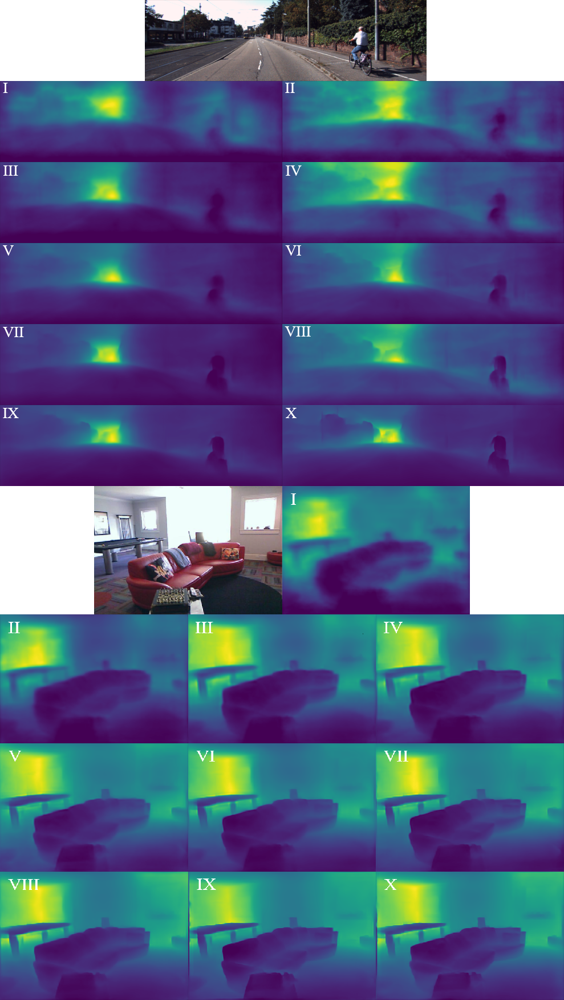

# Monocular Depth Estimation from a Single Image

This repository contains code and experiments for monocular depth estimation using deep convolutional neural networks. The project explores the use of both synthetic and real-world datasets, advanced data augmentation, and state-of-the-art neural architectures to predict depth maps from single RGB images.

## Project Overview

Monocular depth estimation is a fundamental problem in computer vision, with applications in robotics, autonomous vehicles, and augmented reality. This project investigates the effectiveness of training deep neural networks on synthetic datasets and evaluates their performance on both synthetic and real-world test sets.

## Datasets

The following datasets were used:

### Real-World Datasets
- **KITTI**: Outdoor scenes captured from a car, with sparse depth maps (5% of pixels) and a resolution of 1242x375. Evaluation uses the Eigen Split (697 images).
- **NYU Depth V2**: Indoor scenes, 1449 RGB-depth pairs from 464 rooms, dense depth maps, 640x480 resolution. Benchmark for indoor depth estimation.

### Synthetic Datasets
- **Virtual KITTI 2**: 21,260 stereo image pairs with depth and segmentation, 1242x375 resolution.
- **Hypersim**: 77,400 indoor images from 461 rooms, 1024x768 resolution, with dense depth maps.

Due to hardware constraints, only a quarter of Hypersim was used, matching the size of Virtual KITTI 2. Data was split 8:1:1 for training, validation, and testing.

## Methodology

### Data Preparation & Augmentation
- All images converted to tensors and normalized.
- Depth maps restricted to valid ranges and images resized proportionally.
- Augmentations included:
  - Horizontal flipping
  - Red-green channel swapping
  - Random brightness, contrast, and hue changes
  - Vertical CutDepth (replacing vertical slices with depth map fragments)

### Model Architecture
- **MiDaS** architecture with a ResNeXt-101 WSL encoder (pretrained on billions of Instagram images with weak supervision).
- Multi-scale feature fusion for high-resolution depth prediction.
- Encoder-decoder structure.

### Loss Function
- Weighted sum of L1 loss (mean absolute error) and gradient difference loss, computed on aligned depth maps.
- Loss is invariant to scale and shift, improving prediction alignment.

### Optimization
- **AdamW** optimizer with separate learning rates for pretrained and randomly initialized layers (1e-5 and 5e-5).

### Evaluation Metrics
- **RMSE** (Root Mean Squared Error)
- **AbsRel** (Absolute Relative Error)
- **Threshold Accuracy δj** (percentage of predictions within a given deviation from ground truth)
- Evaluation follows affine-invariant depth protocol.

## Training & Usage

To train a model, run:
```bash
python train.py --config config/resnext101_wsl_mixed.yaml --output_dir ./output
```

**Arguments:**
- `--config`: Path to YAML config file (see `config/` for examples)
- `--output_dir`: Directory for checkpoints and logs
- `--base_data_dir`: Path to datasets
- `--no_cuda`: Disable CUDA
- `--resume_run`: Resume from checkpoint
- `--exit_after`: Save checkpoint and exit after X minutes

## Results & Discussion

- Three models were trained: on Hypersim, Virtual KITTI 2, and a mixed dataset.
- Best indoor results: model trained on Hypersim.
- Best outdoor (suburban) results: model trained on mixed data.
- Models performed better on indoor scenes due to lower depth range variability.
- Best NYU Depth v2 result: mean relative error 0.171, with over 75% of pixels within 25% error.
- Synthetic data proved valuable for training deep models, though real-world data and higher image resolutions could further improve results.

### Quantitative Results

**Table 1: Test results on KITTI and NYU Depth v2 datasets**

| Training Data     | KITTI AbsRel ↓ | KITTI RMSE ↓ | KITTI δ₁ ↑ | NYU AbsRel ↓ | NYU RMSE ↓ | NYU δ₁ ↑ |
|------------------|:--------------:|:------------:|:----------:|:------------:|:----------:|:--------:|
| Hypersim         |     0.286      |    6.662     |   0.534    |    0.171     |   0.547    |  0.765   |
| Virtual KITTI 2  |     0.342      |    7.869     |   0.431    |    0.300     |   0.888    |  0.541   |
| Mixed            |     0.266      |    6.518     |   0.562    |    0.196     |   0.614    |  0.709   |

**Table 2: Test results on Virtual KITTI 2 and Hypersim datasets**

| Training Data     | VKITTI2 AbsRel ↓ | VKITTI2 RMSE ↓ | VKITTI2 δ₁ ↑ | Hypersim AbsRel ↓ | Hypersim RMSE ↓ | Hypersim δ₁ ↑ |
|------------------|:----------------:|:--------------:|:------------:|:-----------------:|:---------------:|:-------------:|
| Hypersim         |      0.350       |     8.727      |    0.475     |      0.489        |     2.930       |    0.539      |
| Virtual KITTI 2  |      0.407       |     8.817      |    0.369     |      0.637        |     3.694       |    0.421      |
| Mixed            |      0.320       |     8.186      |    0.483     |      0.548        |     3.310       |    0.486      |

## Example Data Augmentation

Below is an example of data augmentation techniques used in the project:


*Figure: a) Original image, b) Horizontal flip, c) Red-green channel swap, d) Random color adjustment, e) Vertical CutDepth.*

## Epoch improvement visualization


*Figure: A comparison of sample images from the KITTI and NYU Depth v2 datasets with the depth maps predicted by the networks after individual training epochs. The models were trained respectively on mixed data and on the Hypersim dataset.*
